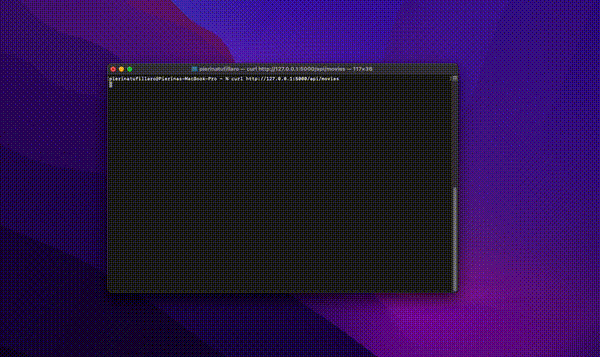

# 🎬 Movie Searcher

Movie Searcher is a simple fullstack web app where users can search movies by title.  
It features a Flask-based API and a React frontend with pagination and live filtering.

---

## 🧠 Features

- Search movies by title (case-insensitive)
- Live filtering and pagination
- Loader while fetching data
- API built with Flask and SQLAlchemy
- Fully tested backend and frontend

---

## 🛠️ Tech Stack

### Backend (Flask API)

- **Flask** (routing and API)
- **Flask jsonify** (to return JSON responses)
- **request** (handle query parameters)
- **SQLAlchemy** (ORM for SQLite)
- **unittest** (for backend testing)
- **pip** (dependency management)

### Frontend (React App)

- **React** with `useState` and `useEffect`
- **Testing Library / React** (for unit tests)

---

## 🚀 Getting Started

### 1. Clone the repo

```bash
git clone git@github.com:PierinaTufillaro/IMDB-Movies.git  
cd IMDB-Movies
```

### 2. Backend set up

Create and activate virtual environment

```bash
cd server
python -m venv env
source env/bin/activate  # On Windows: .\env\Scripts\activate
```

Install dependencies

```bash
pip install -r requirements.txt
```

.env File Configuration

To ensure the application runs correctly, you need to create a file named `.env` in the server folder with the following environment variables:

```env
SECRET_KEY=your_secret_key_here
DATABASE_URI=your_database_uri_here
```

Run python script to populate database taking into account the movies on the IMDb_movies.csv

```bash
cd server
python3 import_csv.py
```

Run Flask app

```bash
python3 run.py
```

By default, the API runs at: http://127.0.0.1:5000/api/movies

### 3. Frontend set up

```bash
cd client
npm install
npm start
```

The frontend runs at: http://localhost:3000/


## 🧪 Running Tests

Backend

```bash
python3 -m unittest discover
```

Frontend

```bash
npm test
```

## 🎥 Demo

How the webapp works


How the API works



